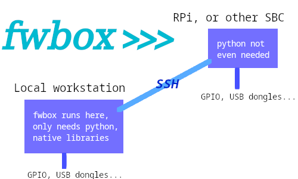
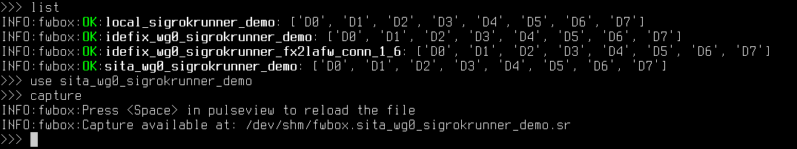
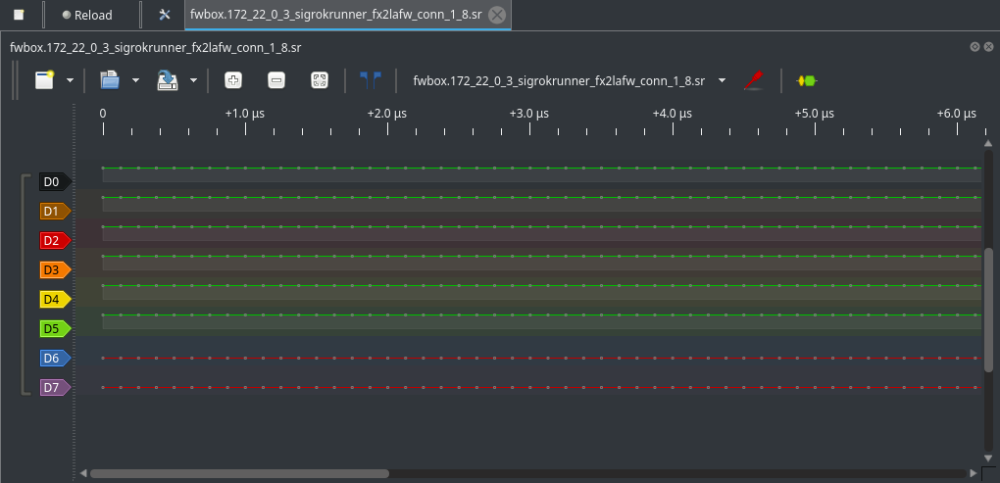

A shell to debug firmware:

* The local machine needs python (no 3rd-party dependency) and an SSH client.

* The debugger machine needs an SSH server and the debugger command installed.

* If debugging is done locally, then SSH is not needed.

Supported debuggers:

* `sigrok-cli <https://sigrok.org/>` supporting many logic analyzers_.

* `gpiod` for connecting to local GPIO chips present on many SBC

Supported operations:

- ``capture`` for recording state changes or full decoding of a protocol

Building
********

This project is not yet on pip, but can be installed from an URL:

.. code-block:: console

   pip install git+https://github.com/panoramix-labs/fwbox

For hacking on it, it can also be built manually this way, within a
`virtualenv <https://docs.python.org/3/library/venv.html>`_:

.. code-block:: console

   python -m build
   pip install .

Example session
***************

Running ``fwbox`` will trigger a scan for local devices and run an
interactive shell:

.. code-block:: console

   INFO:fwbox:Scanning all runners...
   INFO:fwbox:Scannning for SigrokRunner on local
   Shell ready. Type 'help' or '?' to list commands.
   >>>

The ``list`` will show the available devices, state, and channels:

.. code-block:: console

   >>> list
   INFO:fwbox:OK:local_sigrokrunner_demo: ['D0', 'D1', 'D2', 'D3', 'D4', 'D5', 'D6', 'D7']
   INFO:fwbox:OK:local_sigrokrunner_fx2lafw_conn_1_66: ['D0', 'D1', 'D2', 'D3', 'D4', 'D5', 'D6', 'D7']

Running the ``ssh`` comand permits to access more hosts from remote:

.. code-block:: console

   >>> ssh 172.22.0.3
   INFO:fwbox:Scannning for SigrokRunner on local
   INFO:fwbox:Scannning for SigrokRunner on 172.22.0.3
   >>> list
   INFO:fwbox:OK:local_sigrokrunner_demo: ['D0', 'D1', 'D2', 'D3', 'D4', 'D5', 'D6', 'D7']
   INFO:fwbox:OK:local_sigrokrunner_fx2lafw_conn_1_66: ['D0', 'D1', 'D2', 'D3', 'D4', 'D5', 'D6', 'D7']
   INFO:fwbox:OK:172_22_0_3_sigrokrunner_demo: ['D0', 'D1', 'D2', 'D3', 'D4', 'D5', 'D6', 'D7']
   >>>

Now if I unplug ``local_sigrokrunner_fx2lafw_conn_1_66`` and attach it
to the remote computer, it appears as a remote device:

.. code-block:: console

   >>> scan
   ...
   >>> list
   INFO:fwbox:OK:local_sigrokrunner_demo: ['D0', 'D1', 'D2', 'D3', 'D4', 'D5', 'D6', 'D7']
   INFO:fwbox:ERR:local_sigrokrunner_fx2lafw_conn_1_66: ['D0', 'D1', 'D2', 'D3', 'D4', 'D5', 'D6', 'D7']
   INFO:fwbox:OK:172_22_0_3_sigrokrunner_demo: ['D0', 'D1', 'D2', 'D3', 'D4', 'D5', 'D6', 'D7']
   INFO:fwbox:OK:172_22_0_3_sigrokrunner_fx2lafw_conn_1_8: ['D0', 'D1', 'D2', 'D3', 'D4', 'D5', 'D6', 'D7']
   >>>

I can now perform a logic analyzer ``capture`` out of any of these devices:

.. code-block:: console

   >>> use 172_22_0_3_sigrokrunner_fx2lafw_conn_1_8
   >>> capture
   INFO:fwbox:Press <Space> in pulseview to reload the file
   INFO:fwbox:Capture available at: /dev/shm/fwbox.172_22_0_3_sigrokrunner_fx2lafw_conn_1_8.sr

The file ``/dev/shm/fwbox.172_22_0_3_sigrokrunner_fx2lafw_conn_1_8.sr`` can now be opened with
`pulseview <https://sigrok.org/wiki/PulseView>`_ for inspection, using any
`protocol decoder <https://www.sigrok.org/wiki/Protocol_decoders>`_ it supports.

